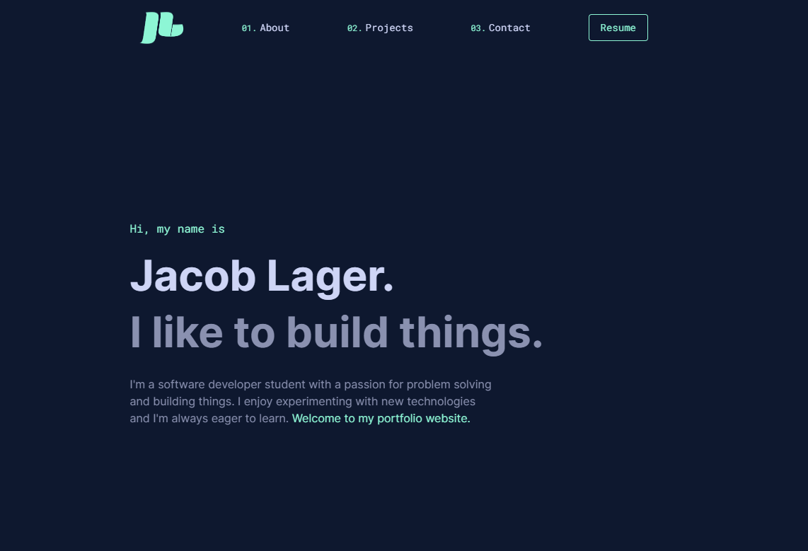

# jacoblager.dev

My personal portfolio website, built with React and Tailwind CSS, hosted at Netlify.



## Run the Project Locally

- Install dependencies

```
npm install
```

- Start the development server

```
npm start
```
